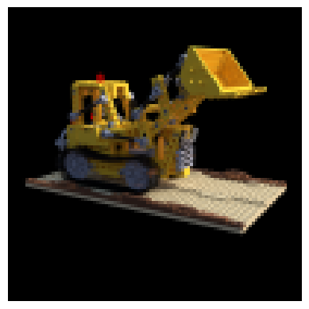
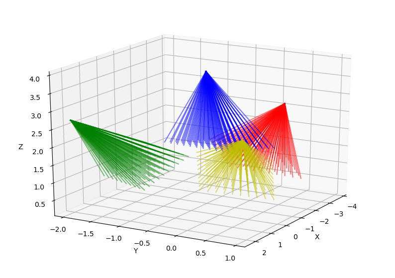
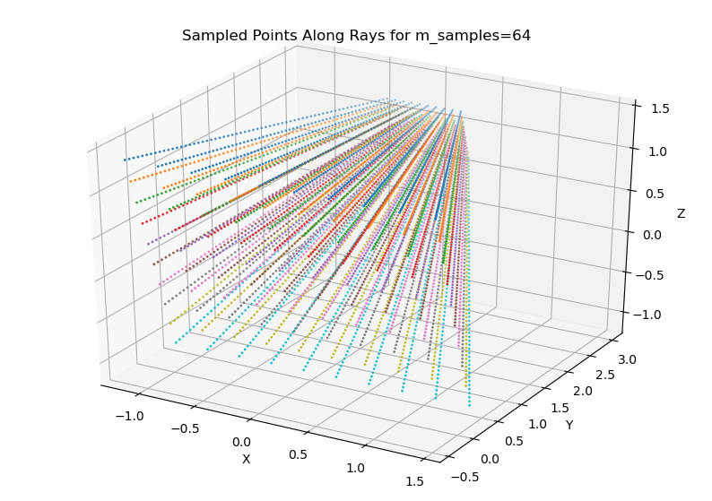
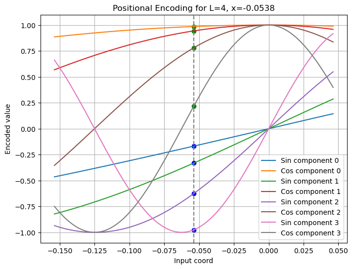

# nerf-from-scratch
My PyTorch implementation of the original NeRF paper: [NeRF - Representing Scenes as Neural Radiance Fields for View Synthesis](https://arxiv.org/pdf/2003.08934.pdf)

[This link](https://dtransposed.github.io/blog/2022/08/06/NeRF/) also guided my implementation.

## 1. Load Dataset

## 2. March Camera Rays Through Scene

## 3. Collect Query Points

## 4. Positional Encoding

## 5. Neural Network Inference
TODO
## 6. Volume Rendering
TODO
